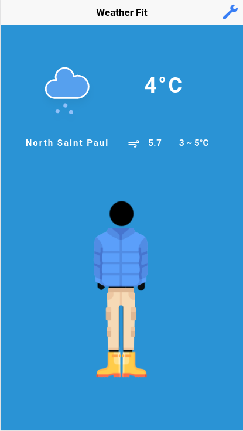

# weatherFit: for the weather confused!

weatherFit is an [Ionic](https://ionicframework.com/) application that help users choose their attire for the day. The app generates choices for tops, bottoms, and accessories that match the weather of the day.

### Getting started

To run weatherFit, you first need to install Ionic. Steps to install Ionic: http://ionicframework.com/docs/v1/guide/installation.html 

To install all the dependencies of the weatherFit app, run this command on your terminal: 

```
$ npm install
```

To run weatherFit, run this command on your terminal:

```
$ ionic serve
```

### User Manual

There are two pages within the weatherFit app: __Home__ and __Settings__.

__Home__



Home is the main page within the app and contains both the day's weather information and the clothing suggestions. 

The upper section of the app contains the current temperature, maximum and minimum temperature, wind speed, and the location of the user. By default, the app accesses the current location of the user. Therefore, the app always needs to be authorized to access the current location from the device. #Add screenshots from the app

The lower section of the app displays the clothing suggestions through the three sliders. The first sliders displays tops, the second bottoms, and the third shoes. #Add screenshts from the app

To change the temperature units or the gender of the clothing, or display/hide the avatar, the user can click on the wrench logo in the upper right corner of the Home page.

__Settings__

Settings is the page where the user can change the temperature units or the gender of the clothing, or display/hide the avatar. When the user is done changing the options, they can click the Back button in the upper left corner of the page and the app will reload to display the weather or clothing suggestions based on the new user preferences.

### Developer Documentation

To access the developer documentation, please refer to `documentation.md` in the repository.
